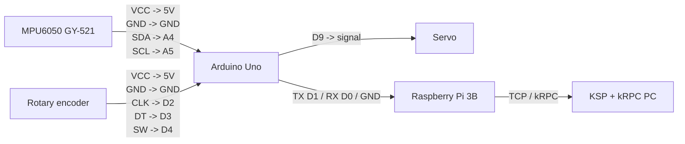

# kRPC / MPU 6050

Flight Hardware: Arduino Uno + MPU6050 + servo + rotary encoder

Raspberry Pi: read IMU data and actuator state from the Arduino, translate that into control commands, send those commands to KSP over TCP using kRPC, and stream KSP telemetry back for logging/visualization.

Simulator Target: KSP + kRPC on your PC

## Design Docs

- [Mission Control V1](docs/mission_control_v1_dd.md): current host-side bridge design with direct telemetry-to-control mapping.
- [Mission Control V2](docs/mission_control_v2_dd.md): planned calibration-first startup flow with host-side axis mapping before kRPC output is enabled.
- [Mission Control V2 Refactor Plan](docs/mission_control_v2_refactor_plan.md): concrete phase-by-phase implementation plan for refactoring `mission_control.py` toward the V2 architecture.


## Hardware Specs

Rotary encoder
IMU: MPU 6050 GY-521
MCU: Arduino Uno

Pi: 3B v1.2

# Integration Plan

Arduino -> Rapsberry Pi: Serial

# Power Plan

MPU 6050: from Uno
Arduino Uno: from the jack
Pi: From usb mini

## Pin Diagram

This is a proposed wiring layout for the current flight hardware stack based on the parts listed above.

Assumptions:
- Servo signal uses `D9`
- Rotary encoder uses `D2` for `CLK`, `D3` for `DT`, and `D4` for the pushbutton
- MPU6050 uses the Uno's default I2C pins (`SDA`/`SCL`)
- Arduino talks to the Raspberry Pi over hardware serial

### Arduino Uno Wiring

| Device | Device Pin | Arduino Uno Pin | Notes |
| --- | --- | --- | --- |
| MPU6050 (GY-521) | VCC | 5V | Power from Uno |
| MPU6050 (GY-521) | GND | GND | Common ground |
| MPU6050 (GY-521) | SDA | SDA / A4 | I2C data |
| MPU6050 (GY-521) | SCL | SCL / A5 | I2C clock |
| Servo | Signal | D9 | PWM output |
| Servo | V+ | External 5V recommended | Avoid drawing servo current from the Uno if possible |
| Servo | GND | GND | Must share ground with Uno |
| Rotary encoder | VCC | 5V | Module power |
| Rotary encoder | GND | GND | Common ground |
| Rotary encoder | CLK | D2 | Primary quadrature signal |
| Rotary encoder | DT | D3 | Secondary quadrature signal |
| Rotary encoder | SW | D4 | Optional pushbutton input |
| Raspberry Pi 3B | RXD (GPIO15, pin 10) | TX / D1 | Serial from Uno to Pi |
| Raspberry Pi 3B | TXD (GPIO14, pin 8) | RX / D0 | Serial from Pi to Uno |
| Raspberry Pi 3B | GND | GND | Shared ground |

### System Diagram



### Quick Reference

```text
Arduino Uno
-----------
A4  <-> MPU6050 SDA
A5  <-> MPU6050 SCL
D2  <- Rotary encoder CLK
D3  <- Rotary encoder DT
D4  <- Rotary encoder SW
D9  -> Servo signal
D0  <-> Raspberry Pi TXD
D1  <-> Raspberry Pi RXD
5V  -> MPU6050 VCC, rotary encoder VCC
GND -> MPU6050 GND, servo GND, rotary encoder GND, Raspberry Pi GND
```

If you want to avoid using the Uno's hardware serial pins for USB debugging, move the Pi link to a software serial pair instead and update the diagram accordingly.

